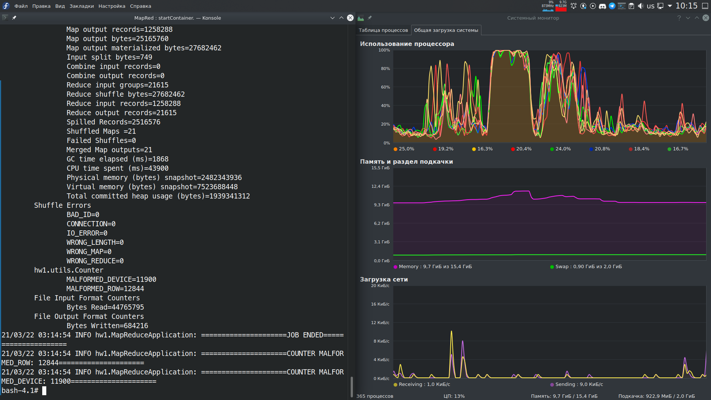

#This README contains screenshots of passed tests, launched MapReduce in pseudo-distributed mode, successfully completed job and listing of output files

### Map, Reduce and MapReduce tests

### Launched HDFS and yarn nodes

 
### Successfully uploaded files into HDFS

### Map phase with system utilization

### Reduce phase with system utilization

### Completed job

### Listing of output directory

### Part of generated output file

